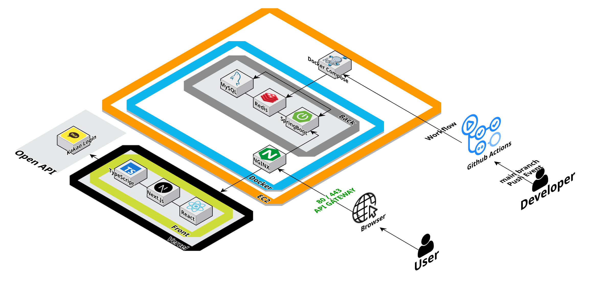

# Tazamore - 취준생들을 위한 힐링 타자 플랫폼 ✨

## 1. 서비스 소개

취업 시장이 어려워지면서 취업을 준비하는 취준생들에게 힐링이 되는 문장을 타이핑하게 함으로써 하루의 시작 또는 끝을 희망차게 만들어주고 싶은 마음에 기획된 서비스입니다. 타자 연습에 힐링 요소와 경쟁 요소를 결합하여, 취업 준비
과정에서 지친 사용자들이 재미있게 집중할 수 있도록 돕는 서비스입니다. 특히, 실시간 랭킹 시스템과 문장 기반 타자 연습을 도입해 동기부여 요소를 강화했습니다.

## 2. 개발 팀원 구성

<div align = "center">

|                                                              **김용범**                                                               |                                                                 **장규범**                                                                  |                                                                                                                            
|:----------------------------------------------------------------------------------------------------------------------------------:|:----------------------------------------------------------------------------------------------------------------------------------------:|
| [ <br/> @Bumnote](https://github.com/Bumnote) | [ <br/> @kyubumjang](https://github.com/kyubumjang) |   
|                                                              Backend                                                               |                                                                 Frontend                                                                 |                                                                                            

</div>

## 3. 백엔드 개발 환경

| Category       | Technology                             |
|----------------|----------------------------------------|
| **Language**   | Java 21                                |
| **Framework**  | Spring Boot 3.4.3                      |
| **Database**   | MySQL 8.0, H2 (Test)                   |
| **Cache**      | Redis 7                                |
| **ORM**        | Spring Data JPA, QueryDSL 5.0.0        |
| **Auth**       | Kakao OAuth2 (OIDC), JWT (JJWT 0.11.5) |
| **Docs**       | Spring REST Docs, AsciiDoc             |
| **Test**       | JUnit 5, JaCoCo                        |
| **Monitoring** | Spring Actuator, Micrometer Prometheus |
| **Infra**      | Docker, Docker Compose                 |
| **Load Test**  | k6, matplotlib                         |

---

## 4. 아키텍처 구조


## 5. 채택한 개발 기술

### 5.1. Kakao OAuth2 + JWT Authentication

카카오 OIDC 기반 소셜 로그인과 JWT 토큰 인증을 결합한 이중 인증 체계입니다.

```
[신규 사용자]
Kakao OAuth → Temp Token (Redis, TTL 3m) → 회원가입 → JWT 발급

[기존 사용자]
Kakao OAuth → JWT 즉시 발급 → 홈 리다이렉트

[게스트]
UUID 기반 세션 → GUEST 권한 → 문장 조회/타이핑 가능

[관리자] 
DB role=ADMIN → JWT (role=ADMIN) → 백오피스 + 전체 기능
```

- **AnonymousAuthenticationToken**: 비회원(GUEST)/회원(USER) 구분
- **Access Token**: 3시간 유효, HttpOnly Cookie
- **Refresh Token**: 7일 유효, Redis 저장
- **Temp Token**: 회원가입 플로우 전용, 3분 TTL

### 5.2. Redis Cache Warming (Phrase Queue)

매일 새벽 3시에 배치 스케줄러가 shuffle된 전체 문장을 Redis에 사전 적재하는 **Cache Warming 패턴**을 적용했습니다.

```
[Batch Scheduler - Daily 03:00]
  DB (findAll) → PhraseResponse JSON 변환 → Shuffle → Redis LIST 저장 (TTL 25h)

[API Request - GET /api/v1/phrases]
  Redis LRANGE (20건) → JSON 역직렬화 → 응답    ← DB 쿼리 0회
  └─ Redis 장애 시 → DB Fallback (findAll + shuffle) ← 가용성 보장
```

- **Redis Key**: `phrase:queue:{yyyy-MM-dd}`
- **데이터 구조**: Redis LIST (셔플된 PhraseResponse JSON)
- **TTL**: 25시간 (일 단위 교체, 1시간 여유)
- **초기화**: `PhraseQueueInitializer`가 앱 시작 시 큐 부재 감지 → 즉시 생성
- **Fallback**: Redis 장애 시 DB 직접 조회로 서비스 중단 없이 운영

### 5.3. 타자 결과 점수 계산 (팀 내 정책 기반)

정확도 기반 패널티를 적용한 타이핑 점수 산정 로직입니다.

```
Score = CPM × (1 - Penalty Rate)

Accuracy ≥ 90%  → Penalty 0%
Accuracy 40~90% → Penalty = 90% - Accuracy
Accuracy 35~40% → Penalty 60%
Accuracy < 10%  → Penalty 100%
```

### 5.4. 실시간(Real-time) 랭킹 & 월별(Monthly Ranking) 랭킹

MySQL Window Function (`DENSE_RANK`)을 활용한 효율적인 랭킹 시스템입니다.

- **실시간 랭킹**: 전체 기간 중 사용자별 최고 점수 기준 Top 50
- **월간 랭킹**: 당월 사용자별 최고 점수 기준 Top 50
- **정렬 기준**: Score DESC → MaxCPM DESC → Accuracy DESC → CreatedDate → ID
- **Redis Sorted Set 캐시**: 실시간 랭킹 데이터를 Redis에 캐싱하여 응답 속도 최적화 (5분 -> 0.004초)

### 5.5. 동의 항목 버저닝

동의 약관 버전 관리 시스템으로, 약관 변경 시 사용자에게 재동의를 요청합니다.

- **관리 대상**: 서비스 이용 약관, 개인정보 처리방침, 14세 미만 이용 제한
- **버전 추적**: 사용자별 동의 버전과 최신 버전 비교
- **재동의 플로우**: 약관 업데이트 감지 → 재동의 요청 → 최신 버전으로 갱신

## 6. k6 부하테스트 진행

k6 부하테스트를 통해 Redis Cache Warming 도입 전후의 성능을 비교했습니다.

### 테스트 환경 

| Item             | Spec                                               |
|------------------|----------------------------------------------------|
| **Infra**        | Docker Compose (MySQL 8.0 + Redis 7 + Spring Boot) |
| **Tool**         | k6 (Grafana)                                       |
| **Load Profile** | Ramping VUs: 10 → 50 → 100 → 200 → 0               |
| **Dataset**      | 100 ~ 100,000 phrases (7-step scaling)             |

### 결과: Before (MySQL) vs After (Redis)

| Dataset Size | DB TPS | Redis TPS |  TPS Gain  | DB P95 | Redis P95 |
|:------------:|:------:|:---------:|:----------:|:------:|:---------:|
|     100      |  341   |    376    | **+10.2%** | 4.11ms |  3.32ms   |
|     500      |  340   |    378    | **+10.9%** | 4.28ms |  4.39ms   |
|    1,000     |  343   |    376    | **+9.7%**  | 3.07ms |  3.09ms   |
|    5,000     |  327   |    377    | **+15.3%** | 2.57ms |  3.85ms   |
|    10,000    |  341   |    378    | **+11.0%** | 2.53ms |  2.45ms   |
|    50,000    |  343   |    376    | **+9.7%**  | 2.53ms |  2.74ms   |
|   100,000    |  341   |    377    | **+10.5%** | 2.64ms |  2.61ms   |

### 핵심 지표

| Metric                 |      Before (DB)      | After (Redis) |       Change       |
|------------------------|:---------------------:|:-------------:|:------------------:|
| **TPS**                |     327~343 req/s     | 376~378 req/s |    **+10~15%**     |
| **Error Rate**         |         0.01%         |     0.00%     |     **-100%**      |
| **DB Load**            | findAll() per request |   0 queries   |     **-100%**      |
| **Tail Latency (MAX)** |       86~215ms        |   59~103ms    | **~50% reduction** |

> Redis Cache Warming 패턴 도입으로 **TPS 10~15% 향상**, **DB 부하 완전 제거**, **에러율 0%**, **Tail Latency 50% 감소**를 달성했습니다.
> 데이터 규모(100~100,000건)에 관계없이 Redis LRANGE O(K) 기반 조회로 일관된 성능을 유지합니다.
